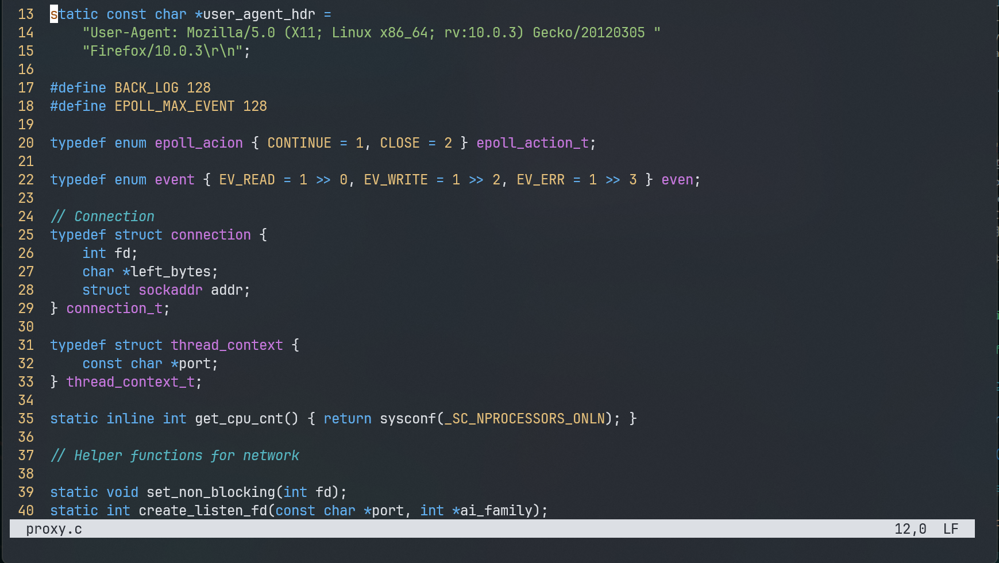

# 🥭Mango

Mango is an modern terminal editor that focuses on simplicity and OOTB.

It's my hobby project. I really don't know how far I could go. Any advice is welcome.



## Target

Terminal editors are always difficult to use, hard to configure. Most of them were designed decades ago, so they have complex key bindings, wierd interfaces and need tons of community plugins to become user-friendly. This project aims to make users life easier --- no more high learning curves, no more tons of plugins, no more hundreds lines of configuration. All just out of box. Having fun with codes!

## Note

Linux only now.

This project is far from mature. Do not use it in the production environment.

## Features

- utf-8 support without grapheme cluster
- mouse support
- simple edit
- syntax highlighting with tree-sitter(only a few languages now)

See docs/help.txt for more infomation

## Build

This project uses CMake build system.

Requirements:

1. A C++ compiler which supports C++17 (I use gcc, clang is not tested)
2. CMake >= 3.22
3. Git
4. make or ninja

```bash
# Debug build
mkdir build && cd build && cmake -DCMAKE_BUILD_TYPE=Debug .. && cmake --build . -j4
# Release build
mkdir build && cd build && cmake -DCMAKE_BUILD_TYPE=Release .. && cmake --build . -j4

# Execute app
./mgo
# Execute test
./test

# Package
mkdir build && cd build && cmake --build . --target package -j4
```
