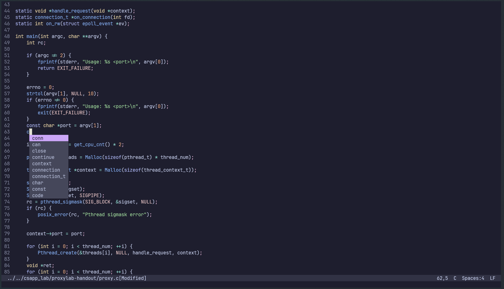

# 🥭Mango

Mango is a modern terminal editor that focuses on simplicity and OOTB.

It's my hobby project. I really don't know how far I could go. Any advice is welcome.



## Target

Terminal editors are always difficult to use, hard to configure. Most of them were designed decades ago, so they have complex key bindings, wierd interfaces and need tons of community plugins to become user-friendly. This project aims to make users life easier --- no more high learning curves, no more tons of plugins, no more hundreds lines of configuration. All just out of box. Having fun with codes!

## Note

Linux only now.

This project is far from mature, so:

- May not be safe for production.
- Breaking changes affecting configurations, keymaps, and related components may be introduced frequently.

## Features

- rich unicode support(utf-8)
- mouse support
- syntax highlighting with tree-sitter(only a few languages now)
- basic word-based auto completion
- colorscheme

See docs/help.md for more infomation

## Build

This project uses CMake build system.

Requirements:

1. A C++ compiler which supports C++17 (GCC >= 8 / Clang >= 7). I prefer Clang.
2. CMake >= 3.22
3. Git
4. make or ninja

```bash
mkdir build && cd build

# Use Clang(optional)
cmake -DCMAKE_C_COMPILER=clang -DCMAKE_CXX_COMPILER=clang++ ..

# Debug build
cmake -DCMAKE_BUILD_TYPE=Debug .. && cmake --build . -j8
# Release build
cmake -DCMAKE_BUILD_TYPE=Release .. && cmake --build . -j8

# Execute app
./mgo
# Execute test
./test

# Package
cmake --build . --target package -j8

# This project agressively use FetchConent.
# Set FETCHCONTENT_FULLY_DISCONNECTED=ON to disable checking
# if you want to frequently modify CMakeLists.txt after a full fetch.
cmake -DFETCHCONTENT_FULLY_DISCONNECTED=ON ..
```
