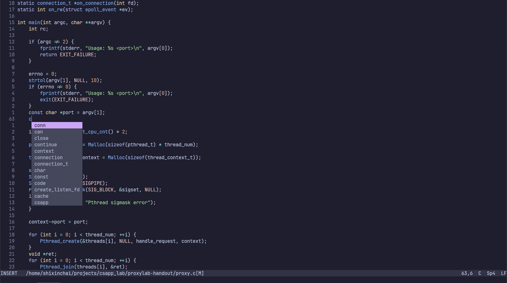

# Mango

A modern text editor that combines modal editing with an intuitive, out-of-the-box experience.



## Target

- Modern: Built on modern editor infrastructure.
- Intuitive: Behaves the way most people would naturally expect.
- Out of the box: Works well from the start, with no need for hundreds of lines of configuration.
- Consistency: Feels predictable and coherent, so similar actions lead to similar results throughout the editor.

## Note

Linux only now.

!!! This project is far from mature, so:

- May not be safe for production.
- Breaking changes affecting configurations, keymaps, and related components may be introduced frequently.

## Features

- Modal editing: Mostly like Vim/Neovim but have some differences. No Vi-compatiblility.
- Rich unicode support(utf-8)
- Mouse support
- Syntax highlighting with tree-sitter(c, c++, json)
- Basic word-based auto completion
- Colorscheme

See [help](./docs/help.md) for more infomation.

See [TODO](./TODO.md) for planned features.

## Build

This project uses CMake build system.

Requirements:

1. A C++ compiler which supports C++17 (GCC >= 8 / Clang >= 7). I prefer Clang.
2. CMake >= 3.22
3. Git
4. make or ninja

```bash
mkdir build && cd build

# Use Clang(optional)
cmake -DCMAKE_C_COMPILER=clang -DCMAKE_CXX_COMPILER=clang++ ..

# Debug build
cmake -DCMAKE_BUILD_TYPE=Debug .. && cmake --build . -j$(nproc)
# Release build
cmake -DCMAKE_BUILD_TYPE=Release .. && cmake --build . -j$(nproc)

# Execute app
./mgo
# Execute test
./test

# Package
cmake --build . --target package -j$(nproc)

# This project agressively use FetchConent.
# Set FETCHCONTENT_FULLY_DISCONNECTED=ON to disable checking
# if you want to frequently modify CMakeLists.txt after a full fetch.
cmake -DFETCHCONTENT_FULLY_DISCONNECTED=ON ..
```
